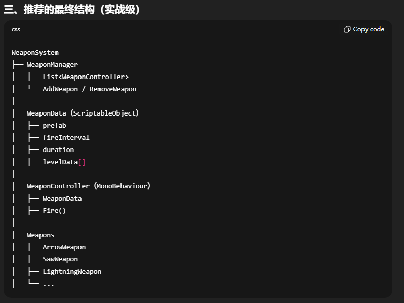

# Vampire Survivors-like

## TODO

- [x] 敌人
  - [x] 血条
  - [x] 敌人生成，在视图外
- [x] 玩家
  - [x] 血条
  - [x] 上下左右移动
- [x] 武器，武器攻击
  - [x] 子弹
  - [x] 箭头
  - [x] 闪电
  - [x] 蓝光爆炸
- [x] 掉落系统，掉落物品
- [x] 伤害飘字

## 武器

武器获取方式
  1. 初始武器 Starting Weapon
     1. 玩家一出生就有，保证活下来
     2. 简单、稳定、不花哨
  2. 升级武器 Level-Up Upgrade
     1. 最核心获取方式
     2. 击杀->升级->3选1
     3. 玩家构筑主战场
  3. 直接掉落 Pickup Weapon
     1. 敌人/宝箱掉落
     2. 即时爽感
     3. 往往是“临时武器”或“变体”
  4. 合成/进化 Evolution
     1. 满级武器+被动条件
     2. 后期爽点爆炸
  5. 关卡/商店解锁 Meta
     1. 局外成长
     2. 控制节奏、解锁多样性

武器类型分类
  1. 近战环绕型 Orbit/Area
     1. 围绕玩家
     2. 持续伤害
     3. 不需要瞄准
     4. 比如：Saw, Whip, Aura
  2. 投射物型 Projectile
     1. 发射 → 飞行 → 命中
     2. 最常见
     3. 扩展性最高
     4. 比如：Knife, Fireball, Arrow
  3. 自动索敌型 Auto Target
     1. 不用瞄准
     2. 优先最近/最弱/Boss
     3. 比如：Lightning, Magic Missile
  4. 区域生成型 Spawn Zone
     1. 在地面/敌人位置生成
     2. 控场型
     3. 比如：Trap, Poison Pool, Meteor
  5. 被动增强型 Passive
     1. 不直接造成伤害
     2. 强化其他武器
     3. 比如：Attack Speed, Range, Cooldown Reduction

## 武器结构布局

